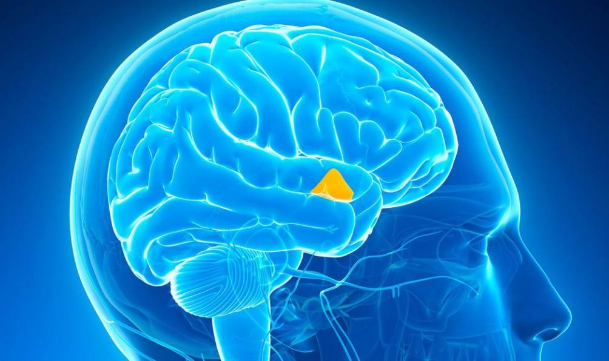
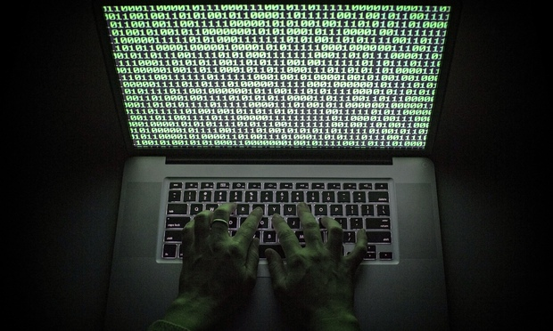

<h3>The Past</h3>

Looking back, math and art classes had always intrigued me. I loved the challenge, critical thinking skills, and problem solving involved with math, but also enjoyed the creativity that art classes required. Because of this, I was torn between two decisions when entering college. My love for science and art had caused a conundrum and as it seemed I had to choose between them. However, when I took a step back and reevaluated both options, neither option truly seemed appealing to me. That was when I had discovered computer science, a field that took the aspects of creativity and problem solving skills that settled the conflict between my heart and my brain.

<h3>The Present</h3>

So far, in my two years of computer science study, I have fallen in love with the subject. As my knowledge of computer science grows, I have found myself becoming more and more interested in cyber security. To me, the subject seems like a perfect blend of art and science: creativity is needed anticipate how hackers will attempt to gain entry to places they should not be in, while knowledge of software engineering and problem solving skills are required to build secure programs. In addition to that, I am interested in web development as well, as the idea of building a fully fledged website from scratch is amazing to me. 

<h3>The Future</h3>

In the coming years, I hope to gain more experience working with others in group settings to become a better communicator. Furthermore, I hope to challenge myself and master different programming languages, such as Javascript, in order to become a more well-rounded programmer. In addition to that, I would like to learn how to become a proper professional in the ICS world and also participate in hackathons. 

