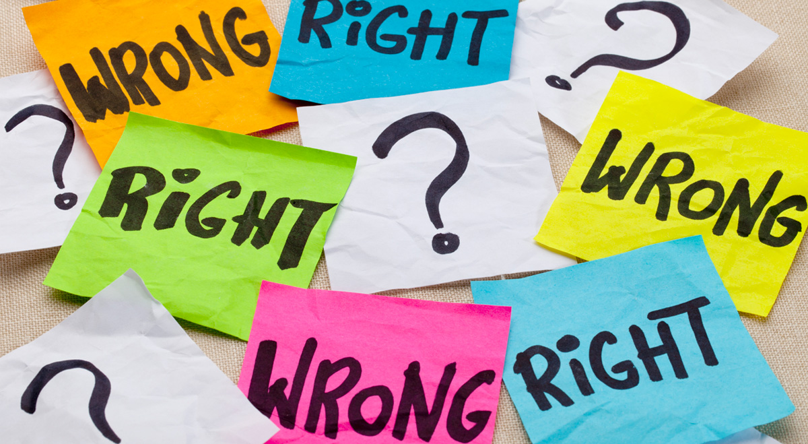

Ethics is a word that often gets thrown around, but is not always completely understood. Furthermore, at a glance, it does not seem as though ethics and software engineering overlap. However, as technology becomes a bigger and bigger part of everyone’s lives, ethics becomes a real issue. While ACM, the Association for Computing Machinery, has pages and pages describing what an ethical software engineer should strive to uphold, but it all boils down to taking care of and watching out for fellow human beings. Looking at it from a software engineering lense, ethics dictates that people should be morally upstanding and aim to protect users and their privacy. As Francis Bacon once said, “Knowledge is power”, and this has never been truer than today, especially when spreading private information about people without their consent can put people at risk.

Case in point, at its surface Google Maps seemed to be no more than a tool to help people navigate themselves. However, it turned out to violate people’s privacy. Google StreetView used cars to photograph areas to build the map, and with this people’s photographs were taken without their consent. For people who were trying to be discrete, such as women leaving abortion clinics, or hiding from someone, like those staying at domestic violence shelters to hide from an abusive partner or stalker, having their location broadcasted on the internet without their consent was not only a breach of privacy, but potentially dangerous as well. While Google Maps attempted to rectify the situation by allowing people to remove their likeness from the photos, the process was initially made to be difficult. Furthermore, these cars took and stored personal information, including medical and financial records, without the owner's’ permission, which, according to the ACM code of ethics, was unethical, as software engineers should strive to protect the privacy of the public and honor their confidentiality. 

Personally, I believe that while Google Maps is a very helpful tool, its creation came about unethically. Google should have never collected and stored personal information located in unencrypted Wi-Fi networks, as this was a clear breach of privacy. Furthermore, bar asking each individual person for permission to take their photograph, Google should have made it easier for people to remove images with themselves in them. By not doing this, Google displayed that they cared more about their product than the safety and wellbeing of the public. As software engineers, we have a duty to not only create and deliver code, but to analyze how our actions benefit or hurt the others as well. While in this case, Google did not act ethically, they have the moral obligation to do better in the future.
