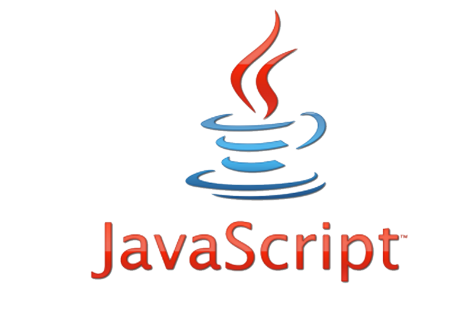

<h3>The Past</h3>

In terms of programming experience, I still consider myself a newbie. While I have experience with Java, C, and some C++, Javascript is a whole different beast to tackle. Unlike C or Java, Javascript feels more flexible in comparison to Java and C, for example: Java and C both require the programmer to specify what data type is being returned from a function and also what data types any passed in parameters are. This, however, does not occur in Javascript, where various different data types can be returned by one function. From a software engineering perspective, I believe that Javascript is a good programming language as it allows programmers to have more freedom when, for example, they are building functions that are meant to be used multiple ways. 

<h3>The Present</h3>

In terms of programming experience, I still consider myself a newbie. While I have experience with Java, C, and some C++, Javascript is a whole different beast to tackle. Unlike C or Java, Javascript feels more flexible in comparison to Java and C, for example: Java and C both require the programmer to specify what data type is being returned from a function and also what data types any passed in parameters are. This, however, does not occur in Javascript, where various different data types can be returned by one function. From a software engineering perspective, I believe that Javascript is a good programming language as it allows programmers to have more freedom when, for example, they are building functions that are meant to be used multiple ways. 

<h3>The Future</h3>

Although this athletic software engineering style of learning is a bit stressful because of the time limit, I feel that it will benefit me in the future, especially during the coding portion of job interviews. Overall, however, I feel like this is an enjoyable way to learn as it forces students take a look at how comfortable they are with coding. In addition, I find that the athletic software engineering is a refreshing change of pace from the usual “lecture in class and occasionally take a test” format that many other classes follow. In some ways, doing practice and official WODS can be fun, especially when you have a peer to compete against to see who had the better time. Therefore, I wholeheartedly believe that this teaching style will work very well for me.
