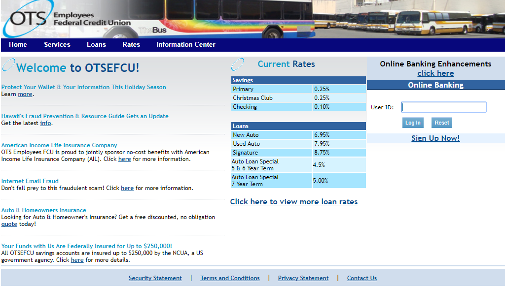

I was hired as an independent contractor by the Oahu Transit Services Employee Federal Credit Union, OTSEFCU, to move their website to a new host. Since the old website was written with PHP in mind and the new host did not accept this format, the website's code had to be translated. 

My list of duties included translating the code from the old format, PHP, into classic ASP. In addition, I had to help set up some databases and also work with the Microsoft SQL Server. Furthermore, I was also in charge of debugging code and making aesthetic changes to the website. 

This assignment was the first big project I had ever taken on. As I had never been exposed to PHP or SQL, I had to rise to the challenge and teach myself these languages by looking up their documentation on my own. Furthermore, my flexibility and customer service skills were improved upon as I had to learn how to effectively communicate with my client to make sure the website was how they imagined it. In addition, this project was the largest I had ever taken on, and thus I had to learn how to properly manage my time in order to meet all the given deadlines.

