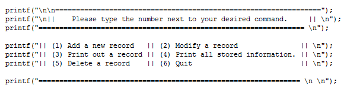

For my ICS 212 class, I created a user interface that would allow the user to interact with a database that would hold accounts consisting of a person’s name, address, and account number. Actions users could take included adding, modifying, or deleting an account, printing a specific account’s information to the screen, and printing the information of all stored accounts to the screen. 

While this project was difficult, it was a learning experience. For one, learning better time management skills were crucial, especially since with the project came a strict due date. Learning how to be better organized was key as well, since, at the time, this project had been the most complex assignment I had ever encountered. The assignment required the use of many different functions, for example: I needed to figure out how to store the actual information into a txt file serving as the database and also figure out how to make the program read that information. 

In order to be successful, I had to know how to break down larger problems into smaller steps that could be handled one at a time. Finally, this project helped sharpen my problem solving skills. Whenever a bug or compiler error appeared, which was not a rare occurrence, I had to be creative and think critically to find the best solution. 

Source: <a href="https://github.com/awyz/database-212">Github</a>
